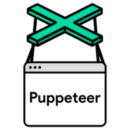

# ioBroker.puppeteer

[](https://www.npmjs.com/package/iobroker.puppeteer)
[](https://www.npmjs.com/package/iobroker.puppeteer)


[](https://nodei.co/npm/iobroker.puppeteer/)

**Tests:** 

## puppeteer adapter for ioBroker

Headless browser to generate screenshots based on Chrome

## Disclaimer
Puppeteer is a product of Google Inc. The developers of this module are in no way endorsed by or affiliated with Google Inc., 
or any associated subsidiaries, logos or trademarks.

## How-To
The adapter is fully configurable via states and does not provide settings in the admin interface.
The states (besides `url`) will not get any ack-flag by the adapter and ack-flags are ignored in general.

### States

#### filename
Specify the filename (full path) of the image.

#### url
Specify the url you want to take a screenshot from. If the state is written, a screenshot will be created immediately.
After the screenshot is created, the adapter will set the ack flag of url state to true.

#### fullPage
If this state evaluates to true, it will perform a screenshot of the full page. The crop options will be ignored.

#### cropLeft/Top/Height/Width
Configure the crop options in `px` to only screenshot the desired segment of the page. 
If `fullPage` is set to true, no cropping will be performed.

#### waitForSelector
The screenshot will be taken after the selector is visible on the page e.g. `#time`. If `waitForSelector` is active, 
other wait oeprations like `renderTime` are ignored.

#### renderTime
Interval in ms to wait till the page will be rendered

### Messages
Alternatively you can take screenshots by sending messages to the adapter.
All options beside from `url` and `ioBrokerOptions` are passed directly to the Puppeteer API, the currently supported parameters can be found
below, for a more up-to-date version check the [API description](https://pptr.dev/api/puppeteer.screenshotoptions). 
Additionally, you can define a `waitOption` to wait for a given time or for a selector. Finally, you can use the `ioBrokerOptions.storagePath` 
option to save screenshots directly to the ioBroker storage under `0_userdata.0` which can then be viewed via admin and visualization adapters.

```typescript
sendTo('puppeteer.0', 'screenshot', { url: 'https://www.google.com',
      ioBrokerOptions?: {
        /**
         * Define a filename for the ioBroker storage e.g. test.png
         */
        storagePath: string;
      },
      /**
       * Define at most one wait option
       * You can also look for other waitOptions currently supported by Puppeteer API
       * see e.g. https://puppeteer.github.io/puppeteer/docs/puppeteer.page.waitforfilechooser
       */
      waitOption?: {
        /**
         * Define a Timeout in ms
         */
        waitForTimeout?: 5000,
    
        /**
         * Wait for a given id/tag/etc to be occured
         */
        waitForSelector?: '#testId'
      },
      /**
       * Optionally, specify the viewport manually, see https://pptr.dev/api/puppeteer.viewport
       */
      viewportOptions?: {
        width: 800,
        height: 600
      },
      /**
       * The file path to save the image to. The screenshot type will be inferred
       * from file extension. If path is a relative path, then it is resolved
       * relative to current working directory. If no path is provided, the image
       * won't be saved to the disk.
       */
      path?: string,
      /**
       * When true, takes a screenshot of the full page.
       * @defaultValue false
       */
      fullPage?: boolean,
      /**
       * An object which specifies the clipping region of the page.
       */
      clip?: {         
        x: number,
        y: number,
        width: number,
        height: number 
      };
      /**
       * Quality of the image, between 0-100. Not applicable to `png` images.
       */
      quality?: number,
      /**
       * Hides default white background and allows capturing screenshots with transparency.
       * @defaultValue false
       */
      omitBackground?: boolean,
      /**
       * Encoding of the image.
       * @defaultValue 'binary'
       */
      encoding?: 'base64' | 'binary',
      /**
       * If you need a screenshot bigger than the Viewport
       * @defaultValue true
       */
      captureBeyondViewport?: boolean,
  }, obj => {
      if (obj.error) {
        log(`Error taking screenshot: ${obj.error.message}`, 'error');
      } else {
        // the binary representation of the image is contained in `obj.result`
        log(`Successfully took screenshot: ${obj.result}`);
      }
});
```

## Changelog
<!--
    Placeholder for the next version (at the beginning of the line):
    ### **WORK IN PROGRESS**
-->
### 0.3.0 (2024-05-19)
* (foxriver76) allowed to specify additional arguments for the puppeteer process
* (foxriver76) updated puppeteer dependency

### 0.2.8 (2024-01-09)
* (foxriver76) update puppeteer dependency

### 0.2.7 (2023-03-18)
* (foxriver76) update puppeteer dependency

### 0.2.6 (2022-08-14)
* (foxriver76) we now close the page also when screenshot taken via message

### 0.2.5 (2022-08-14)
* (foxriver76) we have optimized the viewport option

### 0.2.4 (2022-08-12)
* (foxriver76) allow settings viewport options
* (foxriver76) the default viewport is now the max resolution

### 0.2.3 (2022-08-12)
* (foxriver76) optimized path check for relative paths

### 0.2.1 (2022-06-09)
* (foxriver76) we now install required shared libraries on adapter installation on linux

### 0.2.0 (2022-05-20)
* (foxriver76) added option to save files to the ioBroker storage via messages by using `ioBrokerOptions.storagePath` (closes #2)

### 0.1.0 (2022-05-16)
* (foxriver76) initial release

## License
MIT License

Copyright (c) 2022 Moritz Heusinger <moritz.heusinger@gmail.com>

Permission is hereby granted, free of charge, to any person obtaining a copy
of this software and associated documentation files (the "Software"), to deal
in the Software without restriction, including without limitation the rights
to use, copy, modify, merge, publish, distribute, sublicense, and/or sell
copies of the Software, and to permit persons to whom the Software is
furnished to do so, subject to the following conditions:

The above copyright notice and this permission notice shall be included in all
copies or substantial portions of the Software.

THE SOFTWARE IS PROVIDED "AS IS", WITHOUT WARRANTY OF ANY KIND, EXPRESS OR
IMPLIED, INCLUDING BUT NOT LIMITED TO THE WARRANTIES OF MERCHANTABILITY,
FITNESS FOR A PARTICULAR PURPOSE AND NONINFRINGEMENT. IN NO EVENT SHALL THE
AUTHORS OR COPYRIGHT HOLDERS BE LIABLE FOR ANY CLAIM, DAMAGES OR OTHER
LIABILITY, WHETHER IN AN ACTION OF CONTRACT, TORT OR OTHERWISE, ARISING FROM,
OUT OF OR IN CONNECTION WITH THE SOFTWARE OR THE USE OR OTHER DEALINGS IN THE
SOFTWARE.
